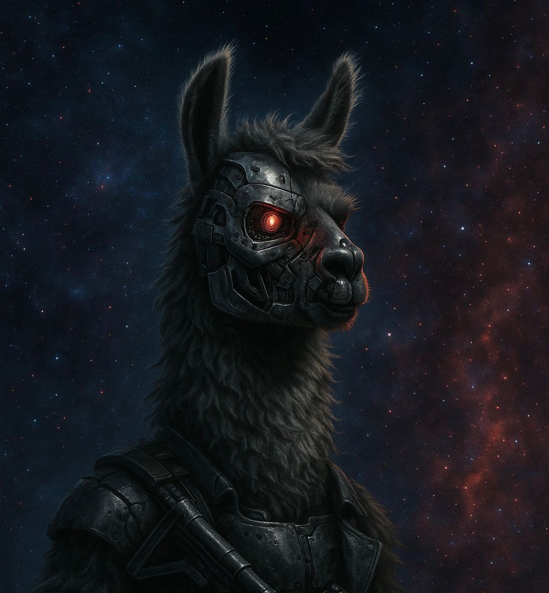
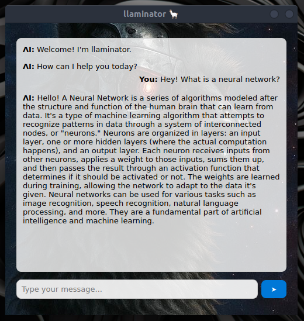

# 🦙 llaminator, a simple chatbot using Ollama. 🦙

<p align="center">
  
</p>

## What is it? 

- llaminator is a chatbot that runs locally with Ollama. You can choose any model in Ollama and use it with this implementation.

**Here is an example of a simple prompt using the Mistral-7B model**




## How was it done?

- PyQt5 Was used to make the graphical interface and Ollama to run models locally

## How to run 

1. Make sure you have Ollama instaled and running.
    - But if you don't have it yet, you can download it [here](https://ollama.com)
    - After that, you need to install a model that you can run. For example, run 'ollama run mistral:7b' in the terminal.

2. Set up your environment with Python 3.10.

3. Install the dependencies by running:
```bash
    pip install -r requirements.txt
```

4. You can select which model you want to run. For example, you can run the chatbot using Mistral-7B, llama3-8b, or any other model provided by ollama.
    - To choose the model, edit the main.py file.

5. Then run the main.py file.


[MIT License](LICENSE).
